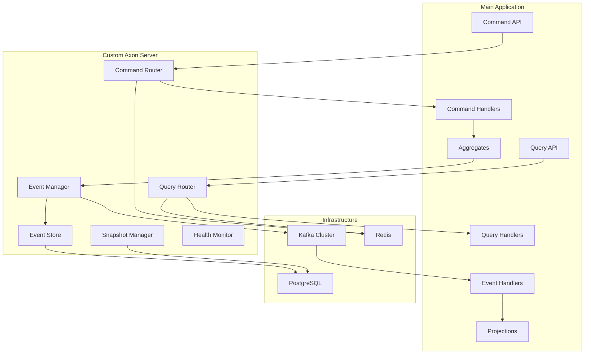

# Design Document

## Overview

This design outlines a custom Axon Framework implementation that replaces Axon Server with a Spring Boot-based solution using Kafka as the messaging backbone. The system consists of two main applications:

1. **Main Application**: A Spring Boot application using Axon Framework for CQRS/Event Sourcing
2. **Custom Axon Server**: A Spring Boot application that provides event store, command routing, and query handling

The architecture leverages Kafka for reliable message distribution, PostgreSQL for event persistence, and Redis for caching and distributed coordination.

## Architecture

### High-Level Architecture



### Component Interaction Flow

1. Commands flow from API → Custom Server → Command Handlers
2. Events flow from Aggregates → Custom Server → Kafka → Event Handlers
3. Queries flow from API → Custom Server → Query Handlers
4. Event persistence happens in Custom Server before Kafka publication

## Components and Interfaces

### Main Application Components

#### Command API Layer
- **CommandController**: REST endpoints for command submission
- **CommandGateway**: Axon's command gateway for dispatching commands
- **CommandInterceptors**: Cross-cutting concerns (validation, security, logging)

#### Query API Layer
- **QueryController**: REST endpoints for query execution
- **QueryGateway**: Axon's query gateway for dispatching queries
- **QueryInterceptors**: Cross-cutting concerns for queries

#### Domain Layer
- **Aggregates**: Domain entities implementing business logic
- **Commands**: Command objects representing user intentions
- **Events**: Event objects representing state changes
- **Sagas**: Process managers for complex business workflows

#### Projection Layer
- **EventHandlers**: Process events to update read models
- **Projections**: Read-optimized data structures
- **QueryHandlers**: Handle queries against projections

### Custom Axon Server Components

#### Command Routing Service
```java
@Service
public class CommandRoutingService {
    // Routes commands to appropriate handlers
    // Maintains routing table in Redis
    // Handles load balancing across instances
}
```

#### Event Store Service
```java
@Service
public class EventStoreService {
    // Persists events to PostgreSQL
    // Manages event sequencing
    // Handles concurrent access
    // Provides event replay capabilities
}
```

#### Query Routing Service
```java
@Service
public class QueryRoutingService {
    // Routes queries to available handlers
    // Implements query load balancing
    // Manages query handler registry
}
```

#### Kafka Integration Service
```java
@Service
public class KafkaEventPublisher {
    // Publishes events to Kafka topics
    // Handles serialization/deserialization
    // Manages topic partitioning strategy
}
```

#### Snapshot Management Service
```java
@Service
public class SnapshotService {
    // Creates and stores aggregate snapshots
    // Optimizes event replay performance
    // Manages snapshot lifecycle
}
```

## Data Models

### Event Store Schema (PostgreSQL)

```sql
CREATE TABLE events (
    id BIGSERIAL PRIMARY KEY,
    aggregate_id VARCHAR(255) NOT NULL,
    aggregate_type VARCHAR(255) NOT NULL,
    sequence_number BIGINT NOT NULL,
    event_type VARCHAR(255) NOT NULL,
    event_data JSONB NOT NULL,
    metadata JSONB,
    timestamp TIMESTAMP WITH TIME ZONE DEFAULT NOW(),
    UNIQUE(aggregate_id, sequence_number)
);

CREATE INDEX idx_events_aggregate ON events(aggregate_id, sequence_number);
CREATE INDEX idx_events_timestamp ON events(timestamp);
CREATE INDEX idx_events_type ON events(event_type);
```

### Snapshot Schema

```sql
CREATE TABLE snapshots (
    id BIGSERIAL PRIMARY KEY,
    aggregate_id VARCHAR(255) NOT NULL,
    aggregate_type VARCHAR(255) NOT NULL,
    sequence_number BIGINT NOT NULL,
    snapshot_data JSONB NOT NULL,
    timestamp TIMESTAMP WITH TIME ZONE DEFAULT NOW(),
    UNIQUE(aggregate_id)
);
```

### Command Routing Schema (Redis)

```json
{
  "command_routes": {
    "CreateUserCommand": ["instance-1", "instance-2"],
    "UpdateUserCommand": ["instance-1", "instance-2"]
  },
  "instance_health": {
    "instance-1": {"status": "healthy", "last_heartbeat": "2024-01-01T10:00:00Z"},
    "instance-2": {"status": "healthy", "last_heartbeat": "2024-01-01T10:00:00Z"}
  }
}
```

### Kafka Topic Structure

- **commands-topic**: Partitioned by aggregate ID for command routing
- **events-topic**: Partitioned by aggregate type for event distribution
- **queries-topic**: Partitioned by query type for query routing
- **snapshots-topic**: For snapshot distribution across instances

## Error Handling

### Command Processing Errors
- **Validation Errors**: Return 400 Bad Request with detailed messages
- **Business Rule Violations**: Return 422 Unprocessable Entity
- **Concurrency Conflicts**: Return 409 Conflict with retry suggestions
- **System Errors**: Return 500 Internal Server Error with correlation IDs

### Event Processing Errors
- **Serialization Errors**: Log error and send to dead letter queue
- **Handler Errors**: Implement retry with exponential backoff
- **Storage Errors**: Implement circuit breaker pattern
- **Network Errors**: Queue events locally until connectivity restored

### Query Processing Errors
- **Handler Not Found**: Return 404 Not Found
- **Query Validation**: Return 400 Bad Request
- **Timeout Errors**: Return 408 Request Timeout
- **Projection Errors**: Return 503 Service Unavailable

## Testing Strategy

### Unit Testing
- **Aggregate Testing**: Test business logic in isolation
- **Command Handler Testing**: Mock dependencies and test behavior
- **Event Handler Testing**: Verify projection updates
- **Service Layer Testing**: Mock external dependencies

### Integration Testing
- **Database Integration**: Test event store operations
- **Kafka Integration**: Test message publishing/consuming
- **Redis Integration**: Test routing and caching
- **API Integration**: Test REST endpoints end-to-end

### Performance Testing
- **Load Testing**: Simulate high command/query throughput
- **Stress Testing**: Test system limits and failure modes
- **Endurance Testing**: Long-running stability tests
- **Scalability Testing**: Test horizontal scaling capabilities

### Contract Testing
- **API Contracts**: Ensure backward compatibility
- **Message Contracts**: Verify Kafka message schemas
- **Database Contracts**: Test schema migrations

## Security Considerations

### Authentication & Authorization
- JWT-based authentication for API access
- Role-based authorization for commands and queries
- Service-to-service authentication using mutual TLS

### Data Protection
- Encrypt sensitive event data at rest
- Use TLS for all network communication
- Implement audit logging for all operations

### Network Security
- API rate limiting and throttling
- Input validation and sanitization
- SQL injection prevention through parameterized queries

## Monitoring and Observability

### Metrics Collection
- Command processing latency and throughput
- Event store performance metrics
- Kafka consumer lag monitoring
- Query response times

### Health Checks
- Database connectivity checks
- Kafka cluster health
- Redis availability
- Custom server component status

### Logging Strategy
- Structured logging with correlation IDs
- Centralized log aggregation
- Different log levels for different environments
- Audit trail for all business operations

## Deployment Architecture

### Container Strategy
- Docker containers for both applications
- Multi-stage builds for optimized images
- Health check endpoints for container orchestration

### Infrastructure Requirements
- Kubernetes cluster for orchestration
- PostgreSQL cluster with read replicas
- Kafka cluster with multiple brokers
- Redis cluster for high availability
- Load balancers for API endpoints

### Configuration Management
- Environment-specific configuration files
- Secret management for sensitive data
- Feature flags for gradual rollouts
- Configuration validation on startup