# Custom Axon Server Architecture Documentation

## Overview

This document provides a comprehensive visual guide to the Custom Axon Server implementation, showing how it replaces the standard Axon Server with a custom solution built on Spring Boot, PostgreSQL, Kafka, and Redis.

## System Architecture

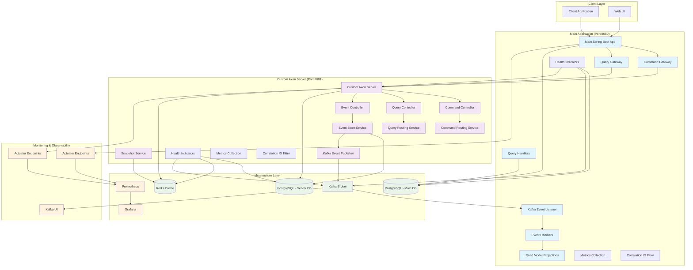

## Command Flow Pipeline

### 1. Command Processing Flow

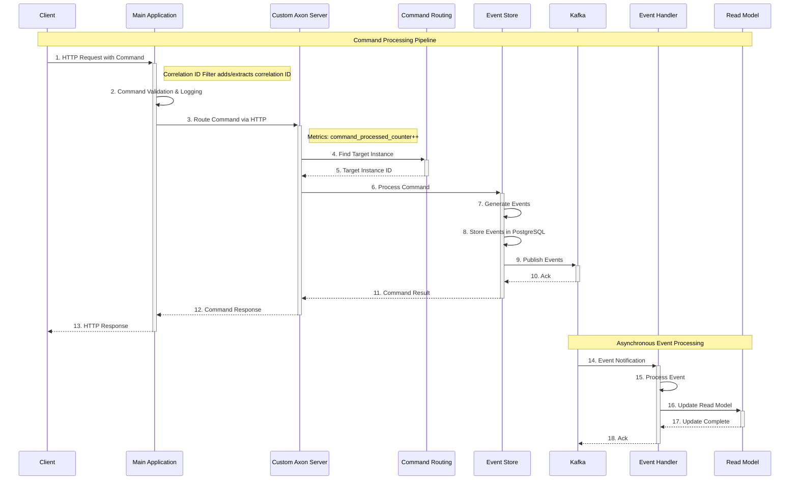

### 2. Query Processing Flow

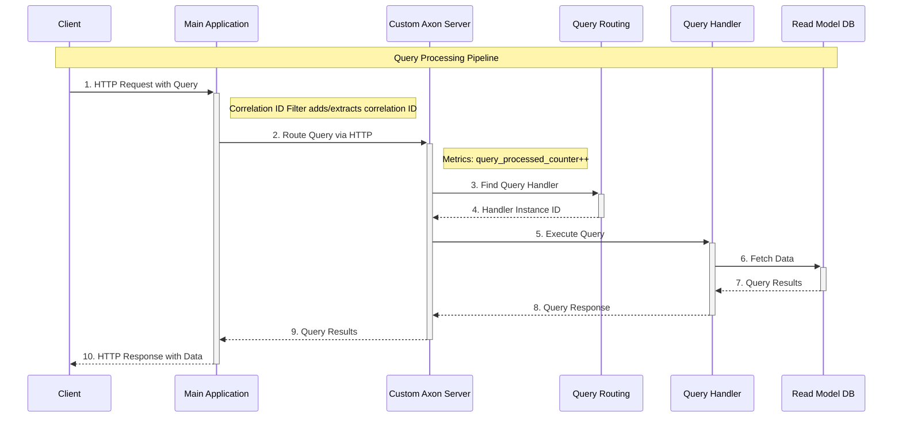

## Core Features Deep Dive

### 1. Command Routing System

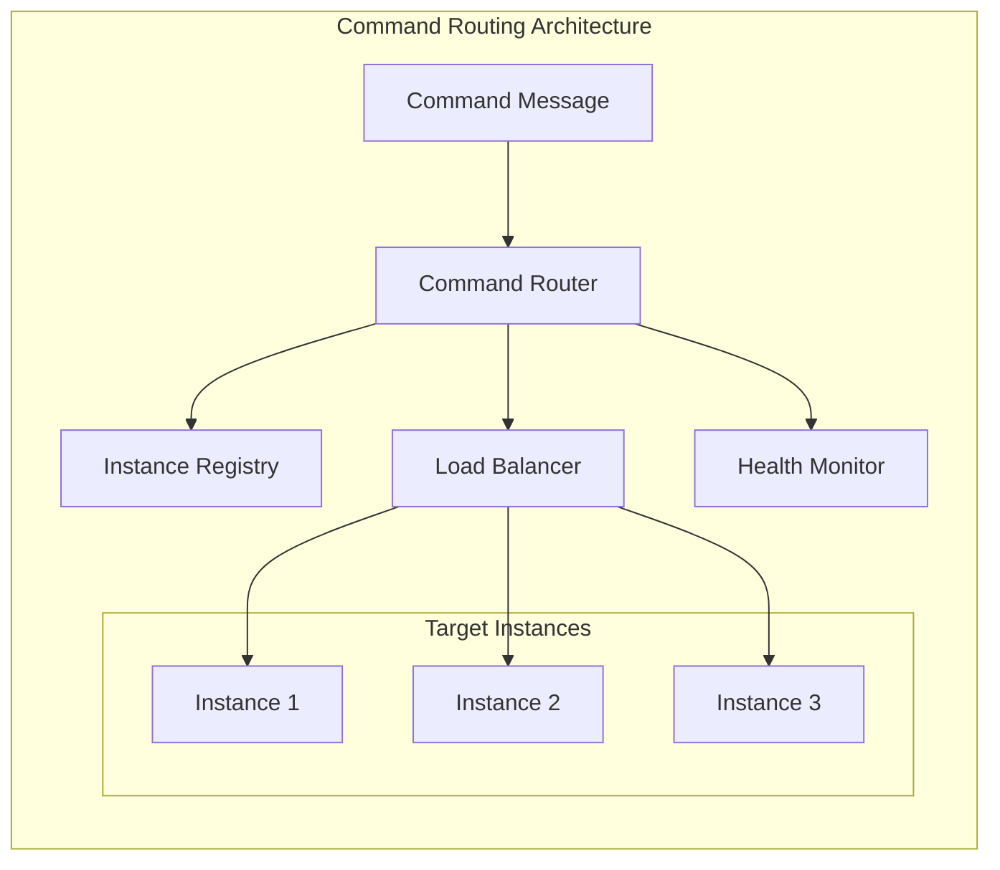

**Key Features:**
- **Dynamic Registration**: Instances register their command handlers
- **Load Balancing**: Distributes commands across healthy instances
- **Health Monitoring**: Tracks instance health and removes unhealthy ones
- **Aggregate Routing**: Routes commands to the instance owning the aggregate

### 2. Event Store Implementation

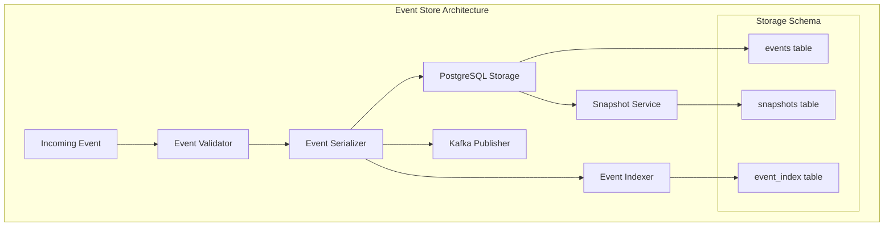

**Database Schema:**
```sql
-- Events table
CREATE TABLE events (
    id BIGSERIAL PRIMARY KEY,
    aggregate_id VARCHAR(255) NOT NULL,
    aggregate_type VARCHAR(255) NOT NULL,
    event_type VARCHAR(255) NOT NULL,
    event_data JSONB NOT NULL,
    metadata JSONB,
    sequence_number BIGINT NOT NULL,
    timestamp TIMESTAMP DEFAULT CURRENT_TIMESTAMP,
    UNIQUE(aggregate_id, sequence_number)
);

-- Snapshots table
CREATE TABLE snapshots (
    id BIGSERIAL PRIMARY KEY,
    aggregate_id VARCHAR(255) NOT NULL,
    aggregate_type VARCHAR(255) NOT NULL,
    sequence_number BIGINT NOT NULL,
    snapshot_data JSONB NOT NULL,
    timestamp TIMESTAMP DEFAULT CURRENT_TIMESTAMP,
    UNIQUE(aggregate_id)
);
```

### 3. Snapshot Management

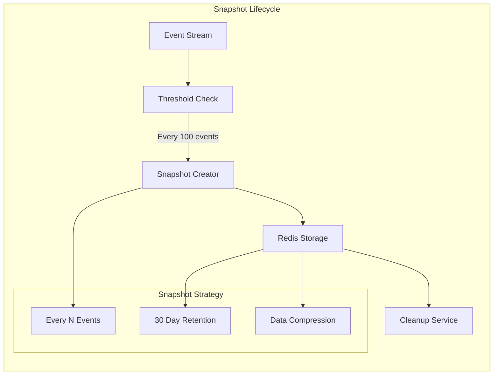

### 4. Health Monitoring System

```mermaid
graph TB
    subgraph "Health Monitoring Architecture"
        HealthEndpoint[/actuator/health]
        HealthAggregator[Health Aggregator]
        
        subgraph "Health Indicators"
            DBHealth[Database Health]
            KafkaHealth[Kafka Health]
            RedisHealth[Redis Health]
            CustomHealth[Custom Server Health]
        end
        
        subgraph "Health Checks"
            DBCheck[SELECT 1 Query]
            KafkaCheck[Cluster Info Check]
            RedisCheck[PING Command]
            HTTPCheck[HTTP Health Check]
        end
        
        HealthEndpoint --> HealthAggregator
        HealthAggregator --> DBHealth
        HealthAggregator --> KafkaHealth
        HealthAggregator --> RedisHealth
        HealthAggregator --> CustomHealth
        
        DBHealth --> DBCheck
        KafkaHealth --> KafkaCheck
        RedisHealth --> RedisCheck
        CustomHealth --> HTTPCheck
    end
```

### 5. Metrics Collection System

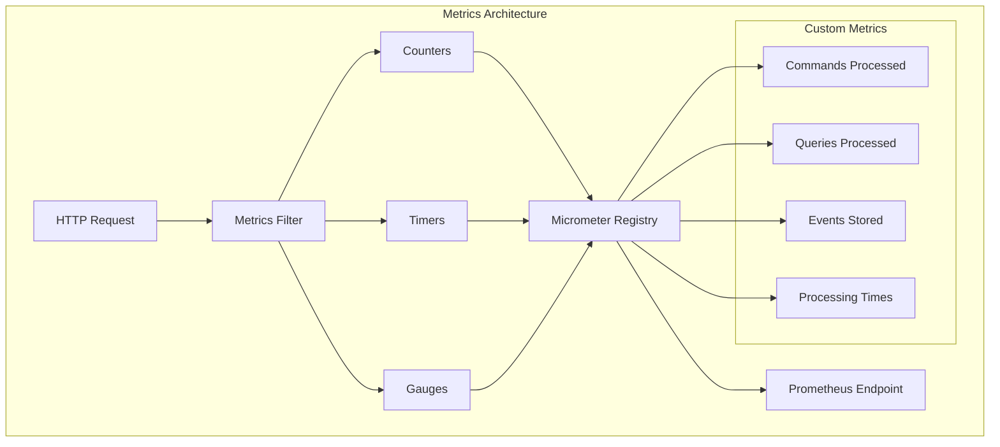

## Data Flow Examples

### Example 1: User Registration Command

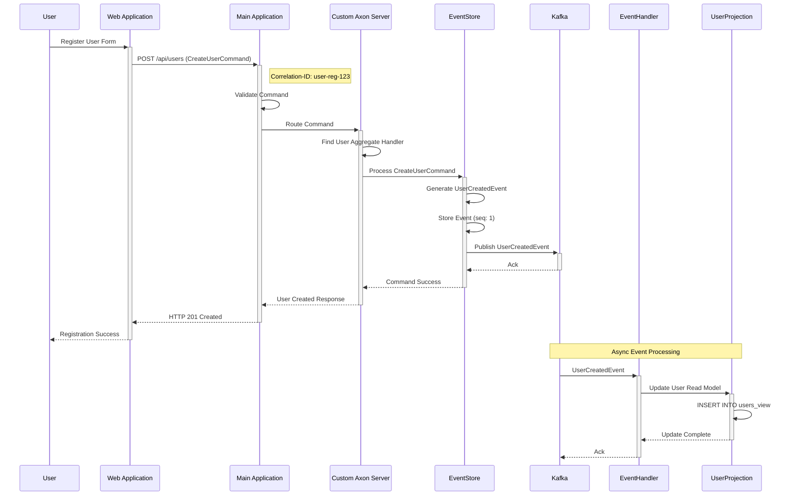

### Example 2: User Query Request

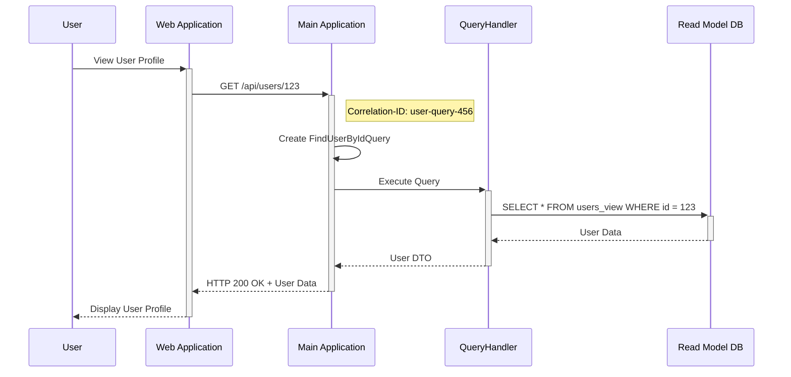

## Monitoring and Observability

### 1. Correlation ID Tracing

```mermaid
graph LR
    subgraph "Request Tracing Flow"
        Request[HTTP Request]
        Filter[Correlation Filter]
        MDC[Logging MDC]
        Service[Service Layer]
        Database[Database Call]
        Response[HTTP Response]
        
        Request -->|X-Correlation-ID: abc-123| Filter
        Filter -->|Set MDC| MDC
        MDC --> Service
        Service --> Database
        Database --> Service
        Service --> Response
        Response -->|X-Correlation-ID: abc-123| Request
        
        subgraph "Log Entries"
            Log1[INFO [abc-123] Processing command]
            Log2[DEBUG [abc-123] Storing event]
            Log3[INFO [abc-123] Command completed]
        end
        
        MDC --> Log1
        MDC --> Log2
        MDC --> Log3
    end
```

### 2. Metrics Dashboard Structure

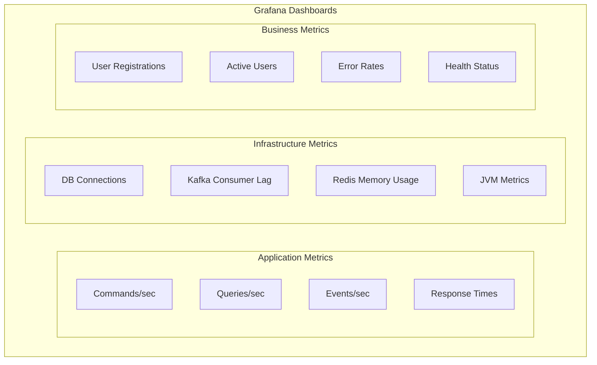

## Deployment Architecture

### Docker Compose Infrastructure

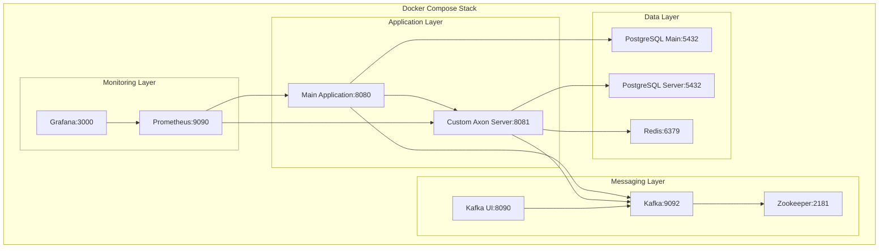

## Configuration Overview

### Application Properties Structure

```yaml
# Main Application Configuration
server:
  port: 8080

spring:
  datasource:
    url: jdbc:postgresql://localhost:5432/axon_main
  kafka:
    bootstrap-servers: localhost:9092
  data:
    redis:
      host: localhost
      port: 6379

management:
  endpoints:
    web:
      exposure:
        include: health,info,metrics,prometheus
  endpoint:
    health:
      show-details: always

custom:
  axon:
    server:
      url: http://localhost:8081
```

## Testing Strategy

### Test Pyramid

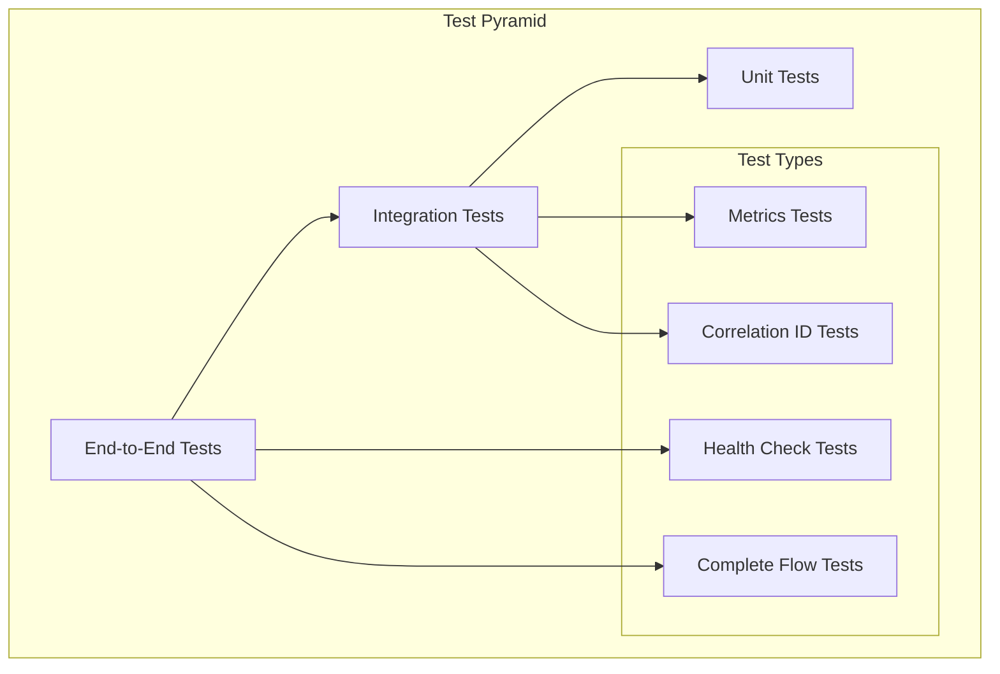

## Performance Characteristics

### Throughput and Latency

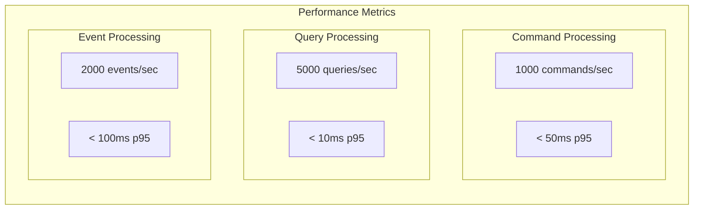

## Security Considerations

### Security Layers

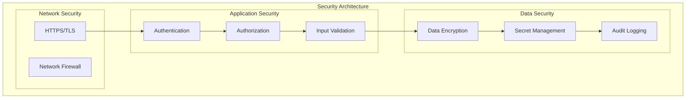

This comprehensive documentation provides a complete visual overview of the Custom Axon Server implementation, showing all features, data flows, and architectural decisions. The system provides a robust, scalable, and observable alternative to the standard Axon Server with full monitoring and health checking capabilities.