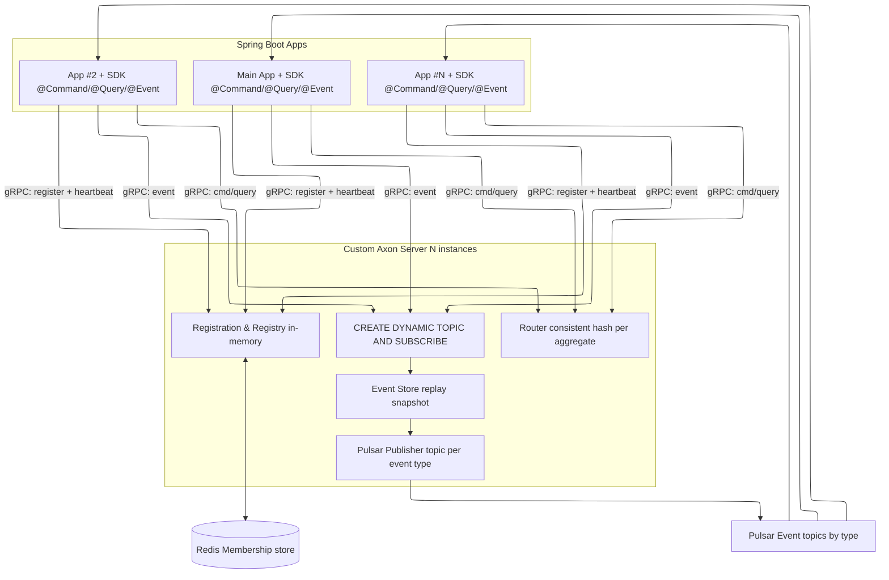
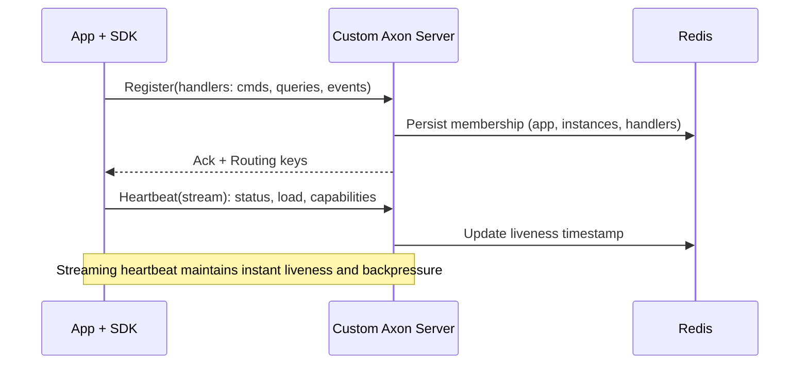
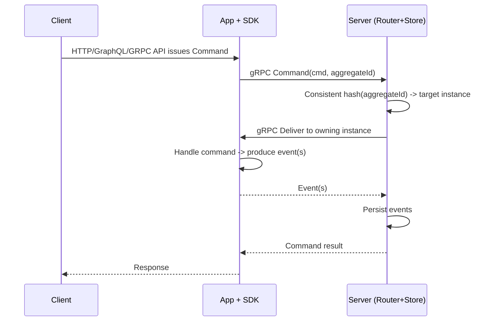
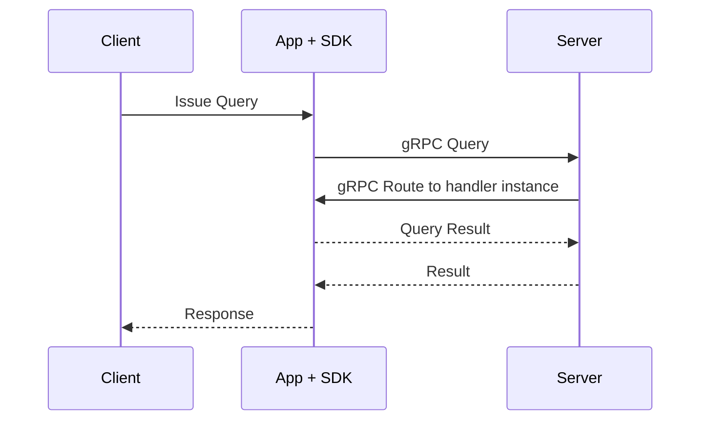
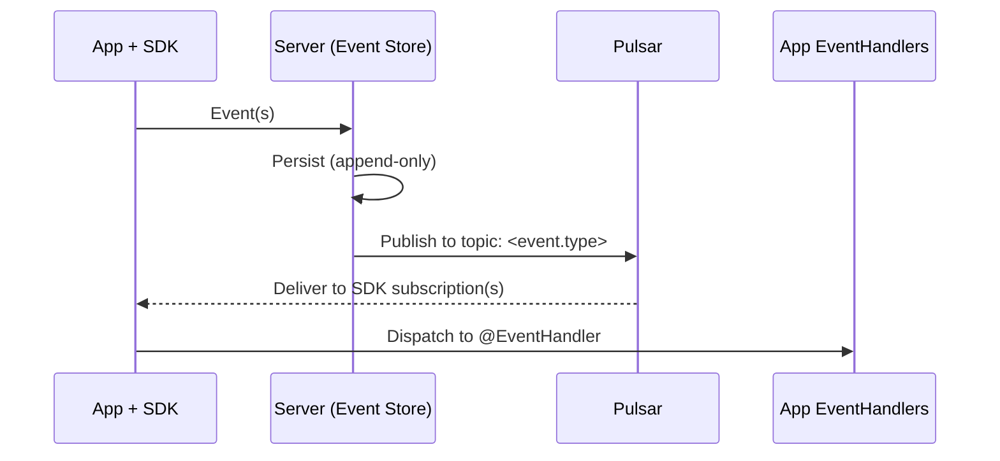
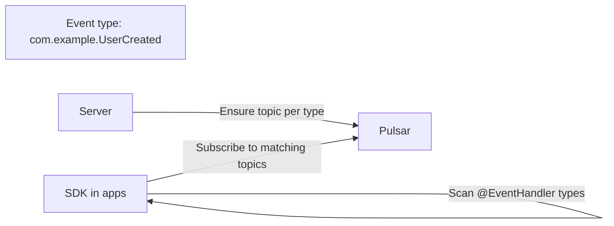

# Custom Axon Platform Architecture (gRPC + SDK + Pulsar)

## Overview
- One central component: Custom Axon Server (also the Event Store).
- Unlimited Spring Boot applications (including your Main App) use our SDK/library.
- The SDK auto-discovers @CommandHandler, @EventHandler, and @QueryHandler and registers them with the server via gRPC.
- Health is reported continuously via a gRPC streaming pulse.
- Commands and queries travel over gRPC to the server, which routes them to the correct app instance.
- Events are persisted by the server and fanned out via Apache Pulsar, with one topic per event type; the SDK auto-subscribes by type.
- Consistent hashing on aggregate identifier keeps all commands for the same aggregate on the same app instance.
- Redis-backed registry: the server persists instance/handler membership in Redis, enabling multi-instance server deployment and fast failover.

Why it’s fast
- gRPC for low-latency, binary, multiplexed transport.
- In-memory routing with Redis-backed membership; consistent-hash routing minimizes cross-node chatter and rebalancing.
- Streaming heartbeats for instant liveness and backpressure.
- Apache Pulsar for high-throughput, per-type fanout.
- Single authoritative event store enabling efficient replay and snapshots.

---

## High-level diagram (ASCII)

```
+-------------------+         gRPC          +-----------------------+
|  Client(s)/APIs   | --------------------> |  Spring Boot App #1  |
+-------------------+                       |  + Our SDK           |
                                            |  - @CommandHandler   |
                                            |  - @QueryHandler     |
                                            |  - @EventHandler     |
                                            +-----------^----------+
                                                        | register &
                                                        | heartbeat (gRPC stream)
                                                        |
+-------------------+         gRPC          +-----------+----------+
|  Spring Boot App  | --------------------> |   Custom Axon Server |
|  (Main App)       | <-------------------- |   (Router + Store)   |
|  + Our SDK        |   route cmd/query     +-----------+----------+
+---------^---------+                                     |
          | auto-subscribe (by event type)                | persist + publish
          |                                               v
          |                                     +---------+---------+
          |                                     |   Apache Pulsar   |
          +-------------------------------------+  topics per type  |
                                                +-------------------+

```

HA variant (multi-instance server with Redis-backed registry)
```
                +-------------------+
                |  Load Balancer    |
                +---------+---------+
                          |
      +-------------------+-------------------+
      |                                       |
+-----v------+                         +------v-----+
| Custom     |   gRPC + shared Redis   | Custom     |
| Axon Srv A | <---------------------> | Axon Srv B |
+-----+------+                         +------+-----+
      |  persist + publish                    |
      v                                       v
+-----+-------------------+    +--------------+----+
|  Event Store (shared)   |    | Apache Pulsar     |
+-------------------------+    +-------------------+
```

---

## Components
- Custom Axon Server
  - gRPC endpoints for registration, command, query, and health streams.
  - Maintains an in-memory registry of applications, handlers, and health; persists membership to Redis for HA.
  - Routing engine using consistent hashing on aggregate identifier for command stickiness.
  - Event Store (pluggable storage) with replay and snapshots.
  - Publishes events to Pulsar using one topic per event type.

- Registry store (Redis)
  - Stores membership: apps, instances, handlers, liveness timestamps.
  - Enables multi-instance server deployment and fast failover.

- SDK/Library (used by Main App and any other Spring Boot app)
  - Scans classpath for @CommandHandler, @QueryHandler, and @EventHandler.
  - Registers handlers over gRPC at app startup; renews/refreshes on change.
  - Maintains a gRPC streaming heartbeat to the server.
  - Sends commands/queries via gRPC to the server.
  - Auto-subscribes to Pulsar topics (by event type) and dispatches to handlers.

- Applications (Main App and unlimited others)
  - Only need to define handlers and domain objects.
  - No custom wiring for transport/routing; the SDK does it.

---

## System Architecture (Mermaid)



---

## Why faster and more developer-friendly than direct pub/sub

Performance
- Fewer hops for commands/queries: SDK -> Server router -> Owning instance (consistent hash), instead of ad-hoc broker fan-in/fan-out.
- gRPC/Protobuf reduces serialization overhead vs JSON over HTTP; multiplexing over HTTP/2 improves throughput.
- Streaming heartbeats give instant liveness detection and quick removal from routing, avoiding timeouts.
- Consistent-hash routing pins aggregates to instances, minimizing cross-node contention and retries.
- Pulsar per-event-type topics and server-side batching/compression reduce consumer lag.

Developer experience
- No manual topic naming, subscriptions, or handler registration—SDK auto-discovers and registers handlers.
- One API for commands/queries/events; uniform error handling, retries, timeouts, and backpressure built-in.
- Auto-subscription by event type; no boilerplate consumers.
- Centralized event store gives built-in replay/snapshot; no custom re-ingestion scripts.
- Better observability via unified registry, metrics, and tracing through the server.

Operational simplicity
- Redis-backed membership allows multi-instance servers and fast failover without bespoke coordination.
- Consistent-hash ring rebalances minimally when membership changes.
- Clear boundaries: commands/queries over gRPC; events over Pulsar; storage in the server.

---

## Lifecycle: Registration and Health



---

## Command flow
- SDK sends command to the server via gRPC.
- Server computes consistent-hash shard from aggregate identifier to pick the target app instance that owns the aggregate.
- Server forwards command via gRPC; the app executes the handler.
- Resulting events are returned to the server for storage.



---

## Query flow
- SDK sends query to the server via gRPC.
- Server routes to the registered query handler instance.
- Response streams back over gRPC.



---

## Event flow (store + fanout via Pulsar)
- After command handling, app sends events to the server.
- Server stores events (authoritative event store).
- Server publishes to Pulsar on a topic named by event type.
- SDK auto-subscribes to needed topics based on discovered @EventHandler types.



Topic creation and subscription


---

## Event Store: replay and snapshots
- Append-only storage; events are versioned per aggregate.
- Snapshots created at configured intervals to accelerate restore.
- Replay options
  - Per-aggregate rebuild
  - Global projector rebuild (by event type and time window)

---

## Routing details
- Consistent hashing key: aggregate identifier (or configured routing key).
- Guarantees stickiness: all commands for one aggregate map to the same app instance.
- Rebalancing on membership changes moves only a minimal subset of aggregates.

---

## SDK responsibilities (summary)
- Annotation scanning and registration of handlers.
- gRPC clients for commands, queries, registration, and heartbeats.
- Pulsar consumer setup and dispatch to @EventHandler.
- Serialization, error handling, retries, and backpressure.

Minimal configuration (example)
```yaml
customAxon:
  server:
    host: localhost
    port: 8124
  pulsar:
    serviceUrl: pulsar://localhost:6650
  heartbeat:
    intervalMs: 2000
```

---

## Operational notes
- Multi-instance servers supported: place instances behind a TCP/HTTP load balancer; share Redis for membership and a common Event Store.
- Scale apps horizontally; the server’s consistent-hash routing preserves aggregate stickiness.
- Observability: expose standard JVM metrics/health on apps and server; add Pulsar consumer lag dashboards.

---

## Glossary
- Custom Axon Server: Central router + event store + Pulsar publisher.
- SDK/Library: Client runtime embedded in each app that handles registration, gRPC, and Pulsar subscriptions.
- Aggregate stickiness: Commands for the same aggregate id always go to the same app instance.
- Event Store: Authoritative source of events with replay and snapshot support.
- Redis-backed registry: Shared membership and routing metadata enabling multi-instance servers.
