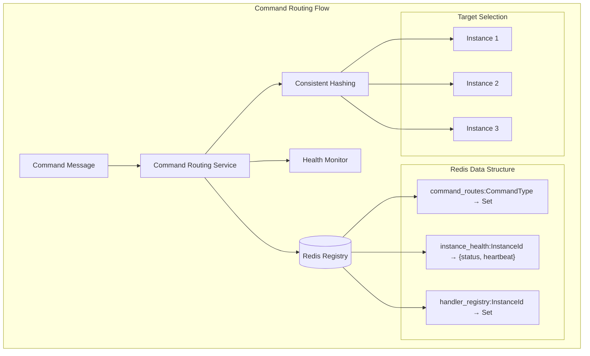
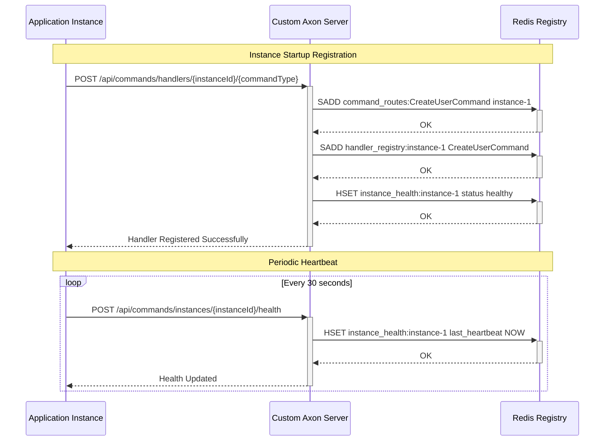
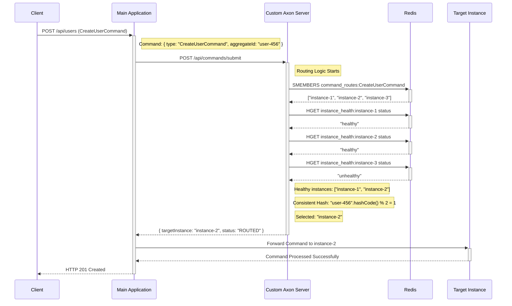

# Command Routing System - Deep Dive

## How Command Routing Works

The command routing system is a **Redis-based distributed routing mechanism** that intelligently routes commands to the appropriate handler instances. Here's exactly how it works:

## 1. Core Architecture



## 2. Redis Data Structures

The routing system uses three main Redis data structures:

### A. Command Routes Registry
```redis
# Key: command_routes:CreateUserCommand
# Value: Set of instance IDs that can handle this command
SADD command_routes:CreateUserCommand "instance-1" "instance-2" "instance-3"
```

### B. Instance Health Registry
```redis
# Key: instance_health:instance-1
# Value: Hash with health status and heartbeat
HSET instance_health:instance-1 
     status "healthy" 
     last_heartbeat "2025-08-14T10:30:00Z"
```

### C. Handler Registry (Reverse Index)
```redis
# Key: handler_registry:instance-1
# Value: Set of command types this instance handles
SADD handler_registry:instance-1 "CreateUserCommand" "UpdateUserCommand"
```

## 3. Step-by-Step Routing Process

### Step 1: Command Submission
```java
// CommandController receives command
@PostMapping("/submit")
public ResponseEntity<CommandResponse> submitCommand(@RequestBody CommandMessage commandMessage) {
    String targetInstance = commandRoutingService.routeCommand(
        commandMessage.getCommandType(),    // e.g., "CreateUserCommand"
        commandMessage.getAggregateId()     // e.g., "user-123"
    );
    return ResponseEntity.ok(CommandResponse.routed(commandMessage.getCommandId(), targetInstance));
}
```

### Step 2: Find Available Instances
```java
public String routeCommand(String commandType, String aggregateId) {
    // 1. Get all instances registered for this command type
    List<String> availableInstances = getHealthyInstances(commandType);
    
    // 2. Filter only healthy instances
    // 3. Apply consistent hashing for aggregate routing
    String selectedInstance = selectInstanceForAggregate(availableInstances, aggregateId);
    
    return selectedInstance;
}
```

### Step 3: Health Filtering
```java
private List<String> getHealthyInstances(String commandType) {
    List<String> allInstances = getInstancesForCommandType(commandType);
    List<String> healthyInstances = new ArrayList<>();
    
    for (String instanceId : allInstances) {
        if (isInstanceHealthy(instanceId)) {  // Check Redis health status
            healthyInstances.add(instanceId);
        }
    }
    return healthyInstances;
}
```

### Step 4: Consistent Hashing Selection
```java
private String selectInstanceForAggregate(List<String> instances, String aggregateId) {
    if (instances.size() == 1) {
        return instances.get(0);
    }
    
    // Use consistent hashing based on aggregate ID
    // This ensures the same aggregate always goes to the same instance
    int hash = Math.abs(aggregateId.hashCode());
    int index = hash % instances.size();
    
    return instances.get(index);
}
```

## 4. Instance Registration Process

### Registration Flow


## 5. Real-World Example

Let's trace a complete command routing example:

### Scenario: User Registration Command



## 6. Key Features Explained

### A. Consistent Hashing
- **Purpose**: Ensures the same aggregate always goes to the same instance
- **Benefit**: Maintains aggregate consistency and enables local caching
- **Algorithm**: `aggregateId.hashCode() % healthyInstances.size()`

### B. Health Monitoring
- **Heartbeat System**: Instances send periodic health updates
- **TTL Expiration**: Health records expire after 2 minutes without heartbeat
- **Automatic Failover**: Unhealthy instances are excluded from routing

### C. Dynamic Registration
- **Runtime Registration**: Instances can register/unregister handlers at runtime
- **Graceful Shutdown**: Instances can cleanly remove themselves from routing
- **Auto-cleanup**: Failed instances are automatically removed

## 7. Load Balancing Strategies

The system supports multiple load balancing approaches:

### Current Implementation: Consistent Hashing
```java
// Ensures same aggregate → same instance
int hash = Math.abs(aggregateId.hashCode());
int index = hash % instances.size();
return instances.get(index);
```

### Alternative: Round Robin (can be implemented)
```java
// Distribute commands evenly across instances
private AtomicInteger roundRobinCounter = new AtomicInteger(0);

private String selectInstanceRoundRobin(List<String> instances) {
    int index = roundRobinCounter.getAndIncrement() % instances.size();
    return instances.get(index);
}
```

### Alternative: Weighted Load Balancing (can be implemented)
```java
// Route based on instance capacity/performance
private String selectInstanceWeighted(List<String> instances) {
    // Implementation would consider instance weights/capacity
    // stored in Redis alongside health information
}
```

## 8. Error Handling & Resilience

### No Healthy Instances
```java
if (availableInstances.isEmpty()) {
    throw new CommandRoutingException("No healthy instances available for command type: " + commandType);
}
```

### Redis Connection Failure
- **Fallback**: Could implement local caching of routing table
- **Circuit Breaker**: Could add circuit breaker pattern for Redis calls
- **Retry Logic**: Built-in Redis template retry mechanisms

### Instance Failure During Command Processing
- **Detection**: Health check failures mark instance as unhealthy
- **Automatic Exclusion**: Failed instances removed from future routing
- **Command Retry**: Could implement command retry to different instance

## 9. Performance Characteristics

### Routing Performance
- **Redis Operations**: O(1) for hash operations, O(N) for set operations
- **Memory Usage**: Minimal - only stores instance IDs and health status
- **Latency**: < 5ms for routing decision (Redis lookup + hash calculation)

### Scalability
- **Horizontal Scaling**: Add more instances by registering new handlers
- **Command Types**: No limit on number of command types
- **Instance Count**: Scales to hundreds of instances per command type

## 10. Implementation Details

### CommandRoutingService Key Methods

#### A. Route Command
```java
public String routeCommand(String commandType, String aggregateId) {
    logger.debug("Routing command {} for aggregate {}", commandType, aggregateId);
    
    List<String> availableInstances = getHealthyInstances(commandType);
    
    if (availableInstances.isEmpty()) {
        logger.error("No healthy instances available for command type: {}", commandType);
        throw new CommandRoutingException("No healthy instances available for command type: " + commandType);
    }
    
    // Use consistent hashing based on aggregate ID to ensure same aggregate
    // always goes to the same instance (when available)
    String selectedInstance = selectInstanceForAggregate(availableInstances, aggregateId);
    
    logger.debug("Selected instance {} for command {} on aggregate {}", 
                selectedInstance, commandType, aggregateId);
    
    return selectedInstance;
}
```

#### B. Register Command Handler
```java
public void registerCommandHandler(String instanceId, String commandType) {
    logger.info("Registering command handler for {} on instance {}", commandType, instanceId);
    
    try {
        // Add instance to the list of handlers for this command type
        String routesKey = COMMAND_ROUTES_KEY + ":" + commandType;
        redisTemplate.opsForSet().add(routesKey, instanceId);
        
        // Update handler registry
        String registryKey = HANDLER_REGISTRY_KEY + ":" + instanceId;
        redisTemplate.opsForSet().add(registryKey, commandType);
        
        // Mark instance as healthy
        updateInstanceHealth(instanceId, "healthy");
        
        logger.debug("Successfully registered command handler for {} on instance {}", commandType, instanceId);
        
    } catch (Exception e) {
        logger.error("Failed to register command handler for {} on instance {}: {}", 
                    commandType, instanceId, e.getMessage(), e);
        throw new CommandRoutingException("Failed to register command handler", e);
    }
}
```

#### C. Health Check
```java
private boolean isInstanceHealthy(String instanceId) {
    try {
        String healthKey = INSTANCE_HEALTH_KEY + ":" + instanceId;
        Map<Object, Object> healthInfo = redisTemplate.opsForHash().entries(healthKey);
        
        if (healthInfo.isEmpty()) {
            return false;
        }
        
        String status = (String) healthInfo.get("status");
        return "healthy".equals(status);
        
    } catch (Exception e) {
        logger.warn("Failed to check health for instance {}: {}", instanceId, e.getMessage());
        return false;
    }
}
```

## 11. Configuration Examples

### Redis Configuration
```yaml
spring:
  data:
    redis:
      host: localhost
      port: 6379
      database: 1
      timeout: 2000ms
      lettuce:
        pool:
          max-active: 8
          max-idle: 8
          min-idle: 0
```

### Command Routing Configuration
```yaml
custom:
  axon:
    routing:
      health-check-interval: 30s
      health-ttl: 2m
      consistent-hashing: true
      load-balancing-strategy: CONSISTENT_HASH
```

## 12. Monitoring & Observability

### Key Metrics to Monitor
```java
// Custom metrics for command routing
@Bean
public Counter commandRoutingSuccessCounter(MeterRegistry meterRegistry) {
    return Counter.builder("command.routing.success")
            .description("Number of successfully routed commands")
            .register(meterRegistry);
}

@Bean
public Counter commandRoutingFailureCounter(MeterRegistry meterRegistry) {
    return Counter.builder("command.routing.failure")
            .description("Number of failed command routing attempts")
            .register(meterRegistry);
}

@Bean
public Timer commandRoutingTimer(MeterRegistry meterRegistry) {
    return Timer.builder("command.routing.duration")
            .description("Time taken to route commands")
            .register(meterRegistry);
}

@Bean
public Gauge activeInstancesGauge(MeterRegistry meterRegistry, CommandRoutingService routingService) {
    return Gauge.builder("command.routing.active.instances")
            .description("Number of active instances")
            .register(meterRegistry, routingService, CommandRoutingService::getActiveInstanceCount);
}
```

### Health Check Endpoints
```java
@GetMapping("/routing/health")
public ResponseEntity<Map<String, Object>> getRoutingHealth() {
    Map<String, Object> health = new HashMap<>();
    health.put("totalInstances", routingService.getTotalInstanceCount());
    health.put("healthyInstances", routingService.getHealthyInstanceCount());
    health.put("commandTypes", routingService.getAllCommandTypes());
    health.put("redisConnected", routingService.isRedisConnected());
    return ResponseEntity.ok(health);
}
```

## 13. Testing Strategy

### Unit Tests
```java
@Test
void routeCommand_WithHealthyInstances_ShouldReturnConsistentInstance() {
    // Given
    String commandType = "CreateUserCommand";
    String aggregateId = "user-123";
    
    // Mock Redis responses
    when(redisTemplate.opsForSet().members("command_routes:" + commandType))
        .thenReturn(Set.of("instance-1", "instance-2"));
    when(redisTemplate.opsForHash().entries("instance_health:instance-1"))
        .thenReturn(Map.of("status", "healthy"));
    when(redisTemplate.opsForHash().entries("instance_health:instance-2"))
        .thenReturn(Map.of("status", "healthy"));
    
    // When
    String result1 = routingService.routeCommand(commandType, aggregateId);
    String result2 = routingService.routeCommand(commandType, aggregateId);
    
    // Then
    assertThat(result1).isEqualTo(result2); // Consistent hashing
    assertThat(result1).isIn("instance-1", "instance-2");
}
```

### Integration Tests
```java
@Test
@Testcontainers
void routeCommand_WithRedis_ShouldWorkEndToEnd() {
    // Given
    String instanceId = "test-instance-1";
    String commandType = "TestCommand";
    String aggregateId = "aggregate-123";
    
    // When
    routingService.registerCommandHandler(instanceId, commandType);
    String routedInstance = routingService.routeCommand(commandType, aggregateId);
    
    // Then
    assertThat(routedInstance).isEqualTo(instanceId);
}
```

This routing system provides a robust, scalable, and fault-tolerant way to distribute commands across multiple handler instances while maintaining aggregate consistency through consistent hashing!

## 14. Future Enhancements

### Possible Improvements
1. **Circuit Breaker Pattern**: Add circuit breakers for Redis operations
2. **Weighted Load Balancing**: Consider instance capacity/performance
3. **Geographic Routing**: Route based on data locality
4. **Command Prioritization**: Priority queues for different command types
5. **Batch Routing**: Route multiple commands in a single operation
6. **Predictive Scaling**: Auto-scale instances based on command load
7. **Command Replay**: Replay failed commands to different instances
8. **Routing Analytics**: Detailed analytics on routing patterns and performance